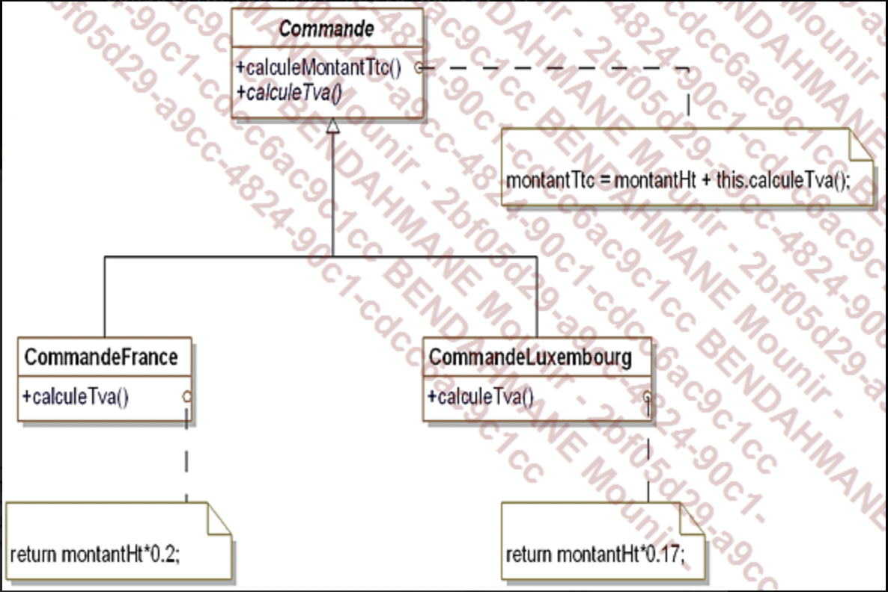
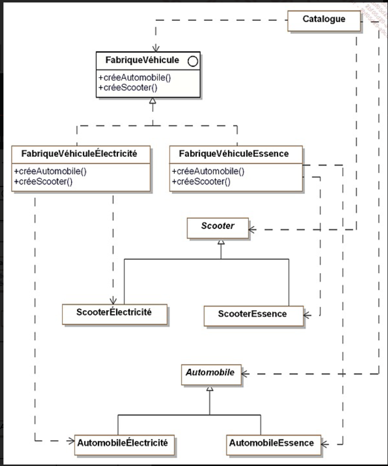
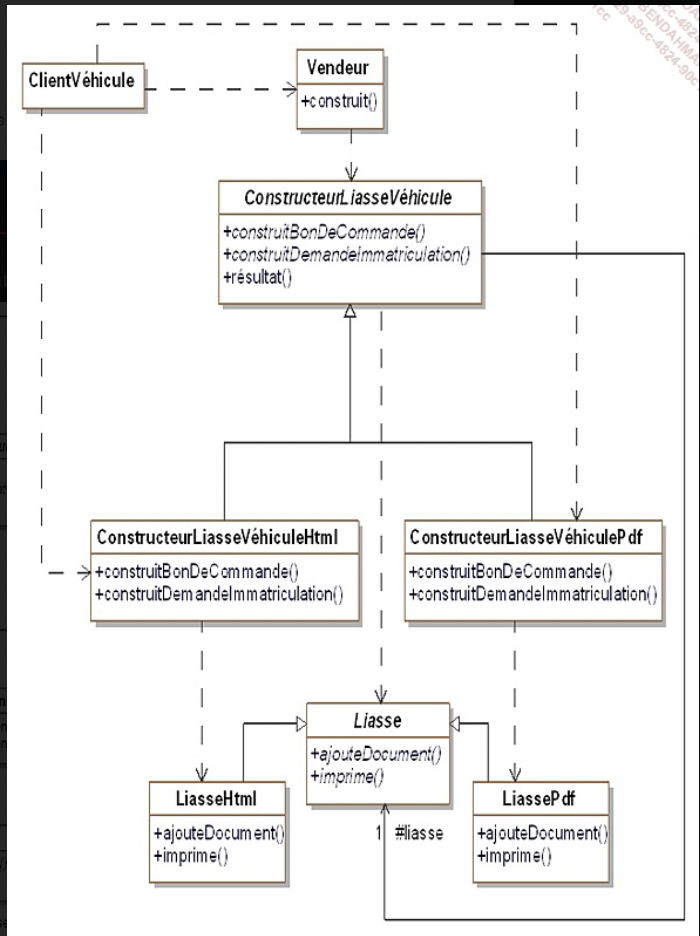

DESIGN PATERNS ou Patterns de conception:

Abstract class:
 

Description d'un design patterns :
- nom
- description
- exemple de code sous forme de diagramme UML
- structure standard (abstraite)
- exemple de code

## CAS D'ÉTUDE POUR CE COURS

Nous allon prendre en exemple le cas d'une societe qui vend des véhicules en ligne

### PREMIERE GRANDE FAMILLE DE DESIGN PATTERN: PATTERN CREATIONAL

DEF : un pattern de construction (BUILDER PATTERN), rend abstrait la créa d'obj, il standardise la création d'objet quelque soit le model.
exemple singleton, un singleton permet de creer une unique instance d'une classe qui est utiliser dans tout le programme 

### PATTERN ABSTRACT FACTORY

    le but est de permettre de fabriquer des objets regroupés en "famille" sans avoir à connaitre les classe cibles destinee a la fabrication de ces objets

    Class les plus générique possible par exemple, au lieu de creer une classe principale voiture ou véhicule, plutot creer une classe produit car l'archi et le code pourras être réutiliser pour d'autre projet.

obj catalogue appel un FabriqueVéhicule (AbstractFactory) qui selon une interface prédéfini appel une classe concrete qui créé l'obj final
exemple : https://github.com/Vatos-robot/AbstractFactory

### PATTERN BUILDER

    Ce pattern permet d'abstraire la construction d'obj complexe de leur implementation de sorte qu'un client puisse creer des objets complexes sans avoir a se preocuper des differences d'implementation 

exemple:  https://github.com/Vatos-robot/builder-pattern

pourquoi utilisateur ce pattern : 
- le client a besoin de contruire des objets sans connaitre leur implementation
- un client a besoin de construire des objets complexes ayant plusieurs representations ou implementations

