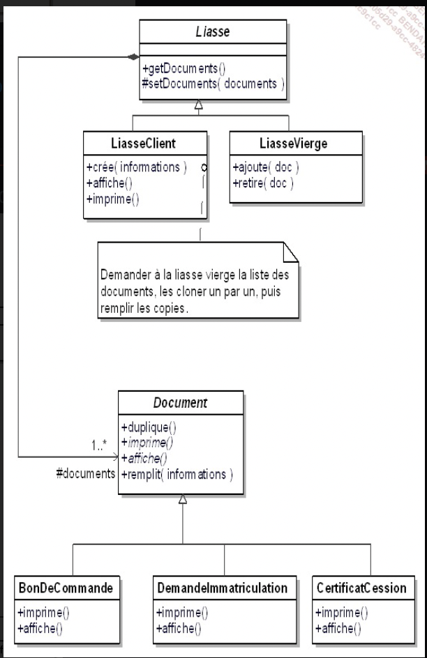
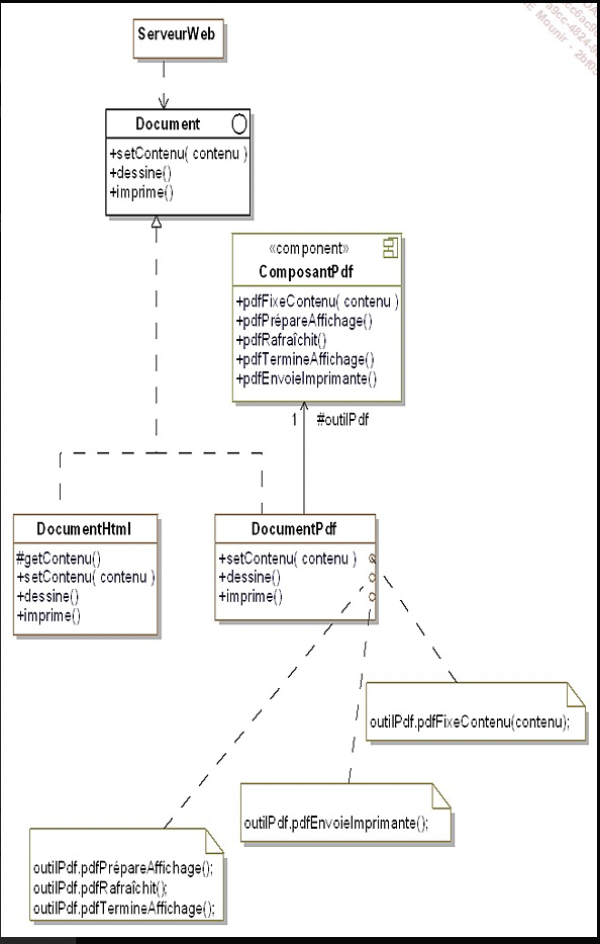
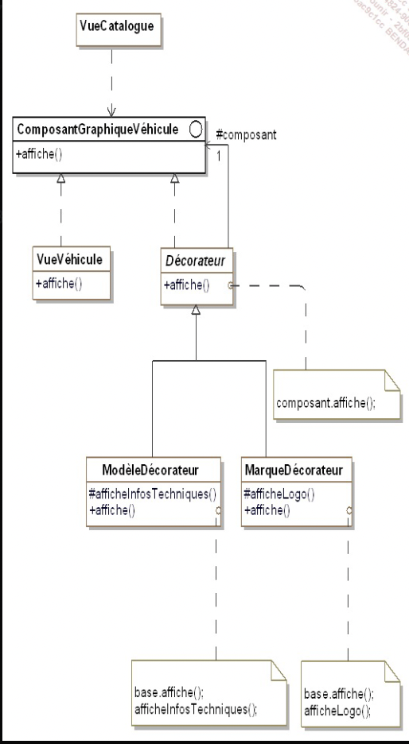

DESIGN PATERNS ou Patterns de conception:

Abstract class:
 

Description d'un design patterns :
- nom
- description
- exemple de code sous forme de diagramme UML
- structure standard (abstraite)
- exemple de code

## CAS D'ÉTUDE POUR CE COURS

Nous allon prendre en exemple le cas d'une societe qui vend des véhicules en ligne

### PREMIERE GRANDE FAMILLE DE DESIGN PATTERN: PATTERN CREATIONAL

DEF : un pattern de construction (BUILDER PATTERN), rend abstrait la créa d'obj, il standardise la création d'objet quelque soit le model.
exemple singleton, un singleton permet de creer une unique instance d'une classe qui est utiliser dans tout le programme 

## PATTERN ABSTRACT FACTORY

    le but est de permettre de fabriquer des objets regroupés en "famille" sans avoir à connaitre les classe cibles destinee a la fabrication de ces objets

    Class les plus générique possible par exemple, au lieu de creer une classe principale voiture ou véhicule, plutot creer une classe produit car l'archi et le code pourras être réutiliser pour d'autre projet.

obj catalogue appel un FabriqueVéhicule (AbstractFactory) qui selon une interface prédéfini appel une classe concrete qui créé l'obj final
exemple : https://github.com/Vatos-robot/AbstractFactory

## PATTERN BUILDER

    Ce pattern permet d'abstraire la construction d'obj complexe de leur implementation de sorte qu'un client puisse creer des objets complexes sans avoir a se preocuper des differences d'implementation 

exemple:  https://github.com/Vatos-robot/builder-pattern

pourquoi utilisateur ce pattern : 
- le client a besoin de contruire des objets sans connaitre leur implementation
- un client a besoin de construire des objets complexes ayant plusieurs representations ou implementations

## Le pattern Factory Method

Le but étant d'introduire une méthode abstraite de création d'objet en la reportant aux sous-classes concretes la création effective
code exemple /FactoryMethod

## Le pattern Singleton 
il faut s'assure de 2 choses lorsqu'on veut mettre en place ce pattern :
- une classe ne doit posseder qu'une seule instance 
- il faut fournir une methode de classe qui permet de fournir cette instance unique 
exemple code : https://github.com/Vatos-robot/singleton

### le pattern prototype 

Le but de ce pattern est de creer de nouveau objets en dupliquant des objets existants appeles "prototypes" 
ces derniers disposent d'une capacité de clonage 

exemple code : https://github.com/Vatos-robot/prototype

### DEUXIEME GRANDE FAMILLE DE DESIGN PATTERN: PATTERN DE STRUCTURATION

L’objectif des patterns de structuration est de faciliter l’indépendance de l’interface d’un objet ou d’un
ensemble d’objets vis-à-vis de son implantation. Dans le cas d’un ensemble d’objets, il s’agit aussi de
rendre cette interface indépendante de la hiérarchie des classes et de la composition des objets.
En fournissant les interfaces, les patterns de structuration encapsulent la composition des objets,
augmentant le niveau d’abstraction du système à l’image des patterns de création qui encapsulent la
création des objets. Les patterns de structuration mettent en avant les interfaces.
L’encapsulation de la composition est réalisée non pas en structurant l’objet lui-même mais en transférant
cette structuration à un second objet. Celui-ci est intimement lié au premier objet. Ce transfert de
structuration signifie que le premier objet détient l’interface vis-à-vis des clients et gère la relation avec le
second objet qui lui gère la composition et n’a aucune interface avec les clients externes.

## Le Pattern Adapter 

le but est d'adapter l'interface d'une classe donnée afin qu'elle puis intéragir avec l'utilisateur

exemple code : https://github.com/Vatos-robot/adapter

## Le Pattern Decorator

Decorator est un modèle de conception structurelle qui vous permet d'attacher de nouveaux comportements à des objets en plaçant ces objets à l'intérieur d'objets wrapper spéciaux qui contiennent les comportements.

TODO 

## Les pattern de comportement

